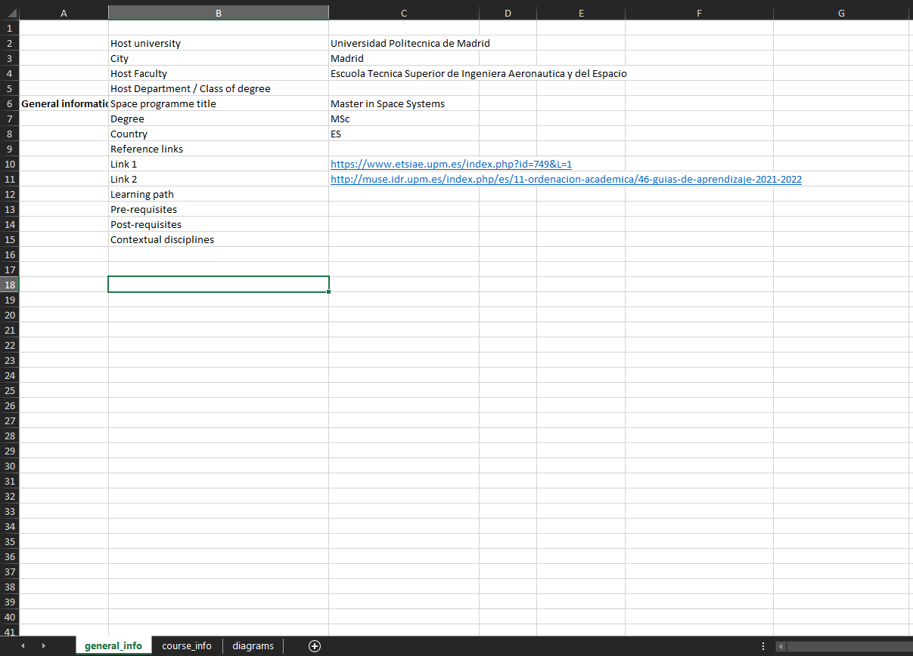
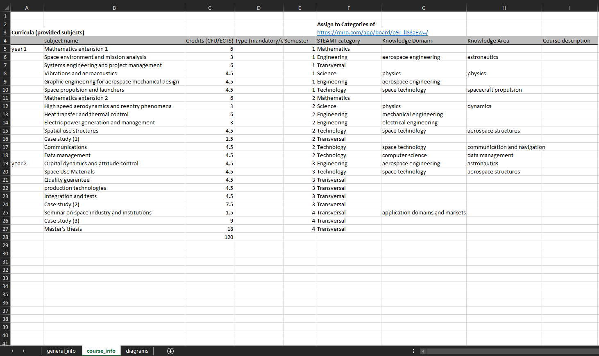

```{r setup, include=FALSE}
knitr::opts_chunk$set(echo = TRUE, eval = TRUE)
```

# Table format 

The new template organizes each curricula in a single Excel file with three tabs: 

1. General information
2. Course information
3. Chart configuration

```{r, fig.show="hold", out.width="50%"}


```

The first tab *General Information* feeds the `hei` and `curricula` tables, and the *Course Information* tab feeds the `courses` table.

The files are stored in a MyFiles cloud storage. We can get them locally as:

```{r, eval = FALSE}
download.file(
  "https://myfiles.sbg.ac.at/index.php/s/SiBSXsqAYBLSGcY/download",
  destfile = "data/curricula.zip",
  method = "curl"
)
unzip(
  "data/curricula.zip",
  exdir = "data",
  overwrite = TRUE
)
```

```{r, message=F, warning=F}
library(readxl)
library(tidyverse)
library(here)

## Get the path to the individual files as a list
data_dir = list.files(
  here("data/Curricula_extracted/standardized_files_curricula"),
  full.names = TRUE, pattern = ".xlsx"
)
```

# Importing general curricula info

To import the first tab of the Excel files, I read in only a specific range, and combine the information in each Excel file and tab in a harmonized way. The file name is stored as a column for each entry.

```{r}
general_info = map(
  data_dir,
  function(x) read_excel(
    path = x,
    sheet = "general_info",
    range = "B2:C17",
    col_names = c("Infotype", "Info")
  ) %>% 
    mutate(file = x) %>% 
    mutate(across(.fns = as.character)) %>% 
    mutate(colName = c(
    "hei_name", "city", "faculty",
    "department", "curricula_name",
    "degree", "country", "reflink",
    "reflink1", "reflink2", "learning_path",
    "pre_requisites", "post_requisites", 
    "contextual_disciplines", "joint_program",
    "credits_specification"
  ))
) %>%  
  bind_rows() %>% 
  select(-Infotype) %>% 
  pivot_wider(
    id_cols = file,
    names_from = colName,
    values_from = Info) %>% 
  relocate(file, .after = everything()) %>% 
  relocate(curricula_name, .after = hei_name) %>% 
  ## Generate unique IDs
  mutate(
    curricula_id = group_indices(
      ., hei_name,
      curricula_name,
      degree
    )
  )
```

We can take a quick look at how it looks like:
```{r, echo = FALSE}
DT::datatable(general_info,
              extensions = 'FixedColumns',
  options = list(
    pageLength = 4,
    dom = 't',
    scrollX = TRUE,
    fixedColumns = list(leftColumns = 3)
  ))
```

## Adding spatial info
If city and country are filled, we can try to geocode the HEI location, and convert into an `sf` object
```{r}
general_info_geo = general_info %>% 
  select(curricula_id, hei_name, city, country) %>% 
  separate(
    hei_name,
    into = c("heiname_1", "heiname_2",
             "heiname_3", "heiname_4",
             "heiname_5"),
    sep = ", "
  ) %>% 
  separate(
    city,
    into = c("city_1", "city_2",
             "city_3", "city_4",
             "city_5"),
    sep = ", "
  ) %>% 
  separate(
    country,
    into = c("country_1", "country_2",
             "country_3", "country_4",
             "country_5"),
    sep = ", "
  ) %>% 
  pivot_longer(
    -curricula_id, 
    names_to = c(".value", "Var"), 
    names_sep="_" 
  ) %>% 
  drop_na(heiname, city, country) %>% 
  select(curricula_id, hei_name = heiname, city, country) %>% 
  mutate(
    hei_name = str_replace(
      hei_name,
      " \\s*\\([^\\)]+\\)", 
      ""
    )
  ) %>% 
  mutate(
    hei_id = group_indices(., hei_name)
  ) %>% 
  left_join(
    select(
      general_info,
      -c(hei_name, city, country)
    ),
    by = "curricula_id"
  ) %>% 
  mutate(
    degree_std = case_when(str_starts(degree, "BSc") ~ "B.Sc.", TRUE ~ "M.Sc."),
    country = case_when(
      country == "UK" ~ "United Kingdom", 
      # country == "US" ~ "U.S.A.", 
      TRUE ~ country
    )
  )
```


```{r}
library(tidygeocoder)
general_info_geocode = general_info_geo %>% 
  geocode(city = city, country = country) 
```
```{r}
library(sf)
general_info_sf = general_info_geocode %>%
  st_as_sf(coords = c("long", "lat"), crs = 4326)
```

# Importing curricula courses

To import the second tab, I read a set column range, and combine the information in each Excel file and tab in a harmonized way. The file name is stored as a column for each entry, which allows in the end to join both tables together.

```{r}
courses = lapply(
  data_dir,
  function(x) read_excel(
    path = x,
    sheet = "diagrams",
    skip = 4,
    range = cell_cols("A:I"),
    col_names = c(
      "module", "course", "credits", "type", "semester",
      "steam_category", "knowledge_domain",
      "knowledge_area", "description"
    )
  ) %>% 
    slice(4:(n()-1)) %>% 
    filter(rowSums(is.na(.)) != ncol(.)) %>% 
    mutate(
      credits = as.numeric(credits),
      file = x
    ) %>% 
    fill(module, .direction = 'down') 
  ) %>% bind_rows() %>% 
  left_join(general_info) %>%
  # Generate unique IDs
  mutate(
    course_id = group_indices(., course, steam_category),
  ) %>% 
  # Clean STEAMT categories
  mutate(
    steam_category = str_to_sentence(steam_category),
    knowledge_domain = str_to_sentence(knowledge_domain),
    knowledge_area = str_to_sentence(knowledge_area)
  ) %>% 
  mutate(
    steam_category = case_when(
      steam_category == "Art" ~ "Arts", 
      steam_category == "Engeineering" ~ "Engineering",
      steam_category == "Transveresal" ~ "Transversal",
      TRUE ~ steam_category)
  ) %>% 
  drop_na(steam_category)
```

## Checking duplicated courses
```{r, echo = FALSE}
duplicated_courses = courses %>% 
  group_by(file, course) %>% 
  summarise(
    .groups = "keep",
    count = n(),
    modules = str_c(module, collapse = ";"),
    credits = str_c(credits, collapse = ";"),
    steam = str_c(steam_category, collapse = ";"),
    k_domain = str_c(knowledge_domain, collapse = ";"),
    k_area = str_c(knowledge_area, collapse = ";"),
  ) %>% 
  filter(count > 1) %>% 
  arrange(desc(count)) 

DT::datatable(duplicated_courses,
  options = list(pageLength = 10))
```

# Populate database 

We will proceed to populate the tables on the database below:

```{r conn_details, eval = TRUE}
library(DBI)
library(RPostgres)
db_name = "starsEU"
local_host = "localhost"
port_num = 5432
user_name = "postgres"
## Create connection to DB
connection = dbConnect(
  Postgres(), 
  dbname = db_name,
  host = local_host, 
  port = port_num,
  user = user_name, 
  password = rstudioapi::askForPassword("Database password")
)

## Test if connection is successful
ifelse(
  !dbExistsTable(connection, "test"),
  "The connection to the database was not possible.",
  "The connection to the database was successful!"
)
```

```{r, eval = FALSE}
curricula_df = general_info_sf %>% 
  st_drop_geometry() %>% 
  select(curricula_id, curricula_name, hei_id,
         pre_requisites, post_requisites,
         degree, degree_std,
         contextual_disciplines, reflink1, reflink2,
         joint_program, credits_specification) %>% 
  distinct(curricula_id, .keep_all = TRUE)

dbWriteTable(connection, "curricula",
             curricula_df, append = TRUE,
             row.names = FALSE)
```

```{r, eval = FALSE}
hei_df = general_info_sf %>% 
  select(
    hei_id, hei_name, curricula_id, 
    faculty, department,
    city, country, geometry
  ) %>% 
  distinct(hei_id, .keep_all = TRUE)

dbWriteTable(connection, "hei", hei_df,
             append = TRUE, row.names = FALSE)
```

```{r, eval = FALSE}
courses_df = courses %>% 
  select(course_id, course_name = course, 
         curricula_id, module,
         credits, type, semester, steam_category, 
         knowledge_domain, knowledge_area, description) %>% 
  distinct(course_id, .keep_all = TRUE)
dbWriteTable(connection, "courses",
             courses_df, append = TRUE, row.names = FALSE)
```

```{r}
dbDisconnect(connection)
```
