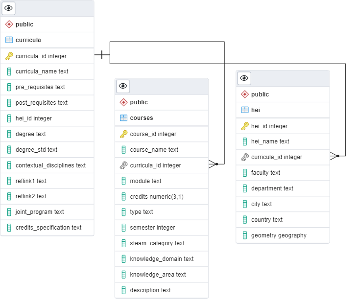

```{r setup, include=FALSE}
knitr::opts_chunk$set(echo = TRUE, eval = FALSE)
```

# Pre-requisites  

0. Install PostgreSQL [here](https://www.postgresql.org/download/). For version 14 the installation process also includes pgadmin4, and let's you add the PostGIS extension on the Stack Builder application. 

1. [Create a spatial database with pgadmin4](https://postgis.net/workshops/postgis-intro/creating_db.html). To test connection an empty table on the database called `test` should be created on the public schema
    + Tip: Run `FULL VACUUM/ANALYZE` frequently on the database to improve performance
    + Follow the tips on [this presentation](https://thebuild.com/presentations/not-your-job.pdf) to increase performance of the database

2. Create a password file on `%APPDATA%/postgresql/pgpass.conf` with the format *hostname:port:database:username:password*    

# Connecting to the database
I will initially use R to connect and configure the database. Among other tasks, the idea is to create extensions and tables. 

```{r libraries, eval = TRUE, include = FALSE}
library(DBI)
library(RPostgres)
```

Here the details of the database can be changed: 
```{r conn_details, eval = TRUE}
db_name = "starsEU"
local_host = "localhost"
port_num = 5432
user_name = "postgres"
```

To test connection we will try to fetch the `test` table, created during the pre-requisites (see above). 
The password is asked actively for the moment.
```{r conn, eval = TRUE}
## Create connection to DB
connection = dbConnect(
  Postgres(), 
  dbname = db_name,
  host = local_host, 
  port = port_num,
  user = user_name, 
  password = rstudioapi::askForPassword("Database password")
)

## Test if connection is successful
ifelse(
  !dbExistsTable(connection, "test"),
  "The connection to the database was not possible.",
  "The connection to the database was successful!"
)
```

# Configuring the database 
From here on we will work with SQL queries. 
First, we create some extensions:
```{sql, connection = connection}
CREATE EXTENSION IF NOT EXISTS hstore;
```
```{sql, connection = connection}
CREATE EXTENSION IF NOT EXISTS postgis;
```

## Tables

For now I have structured the table creation into 3, considering the current structure of the Excel files:

1. `curricula` with general information on the program itself
1. `hei` Higher Education Institution (HEI), which contain the information of the host universities
1. `courses` with the individual courses and their respective categories

```{sql, connection = connection}
DROP TABLE IF EXISTS curricula CASCADE;
```
```{sql, connection = connection}
CREATE TABLE curricula (
    curricula_id INT GENERATED ALWAYS AS IDENTITY,
    curricula_name TEXT,
    pre_requisites TEXT,
    post_requisites TEXT,
    hei_id INT,
    degree TEXT,
    degree_std TEXT,
    contextual_disciplines TEXT,
    reflink1 TEXT,
    reflink2 TEXT,
    joint_program TEXT,
    credits_specification TEXT,
    PRIMARY KEY(curricula_id),
    CONSTRAINT fk_hei
      FOREIGN KEY(hei_id)
        REFERENCES hei(hei_id)
        ON DELETE SET NULL
);
```

```{sql, connection = connection}
DROP TABLE IF EXISTS hei CASCADE;
```
```{sql, connection = connection}
CREATE TABLE hei (
    hei_id INT GENERATED ALWAYS AS IDENTITY,
    hei_name TEXT,
    curricula_id INT,
    faculty TEXT,
    department TEXT,
    city TEXT,
    country TEXT,
    geometry geography(POINT,4326),
    PRIMARY KEY(hei_id),
    CONSTRAINT fk_curricula
      FOREIGN KEY(curricula_id)
        REFERENCES curricula(curricula_id)
        ON DELETE SET NULL
);
```

```{sql, connection = connection}
DROP TABLE IF EXISTS courses;
```
```{sql, connection = connection}
CREATE TABLE courses (
    course_id INT GENERATED ALWAYS AS IDENTITY,
    course_name TEXT,
    curricula_id INT,
    module TEXT,
    credits NUMERIC(3,1),
    type TEXT,
    semester INT,
    steam_category TEXT,
    knowledge_domain TEXT,
    knowledge_area TEXT,
    description TEXT,
    PRIMARY KEY(course_id),
    CONSTRAINT fk_curricula
      FOREIGN KEY(curricula_id)
        REFERENCES curricula(curricula_id)
        ON DELETE SET NULL
);
```


> DISCONNECT: Important when modifying the database on pgadmin4

```{r, eval = TRUE}
dbDisconnect(connection)
```

A quick overview of how the database looks like so far:

